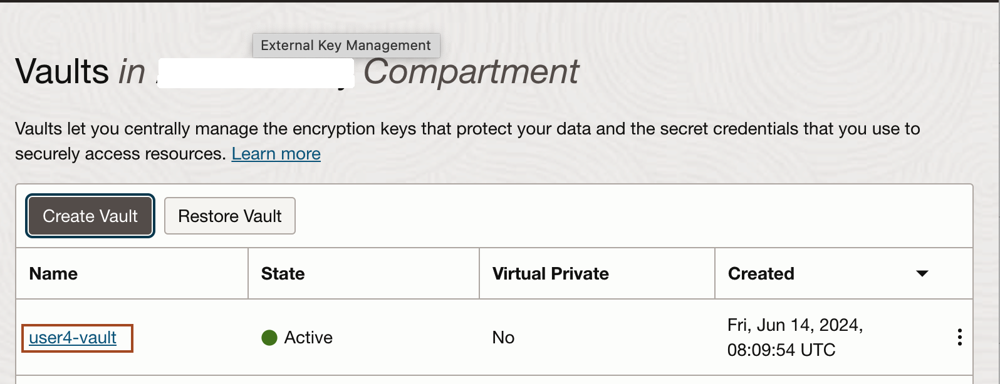
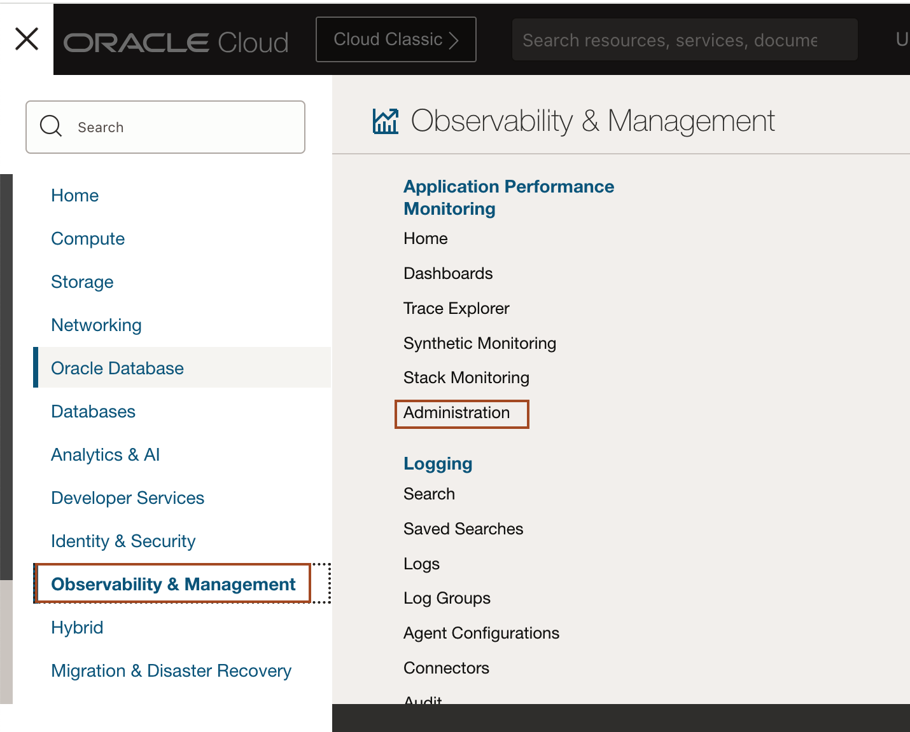

# Create the OCI resources

## Introduction
Before demonstrating autoscaling in the WebLogic for OCI stack, several prerequisites must be met to ensure a secure and efficient setup. This lab covers generating an authentication token, creating a Vault with encryption keys and secrets, setting up an Application Performance Monitoring domain, and generating a pair of SSH keys. These foundational steps are essential for securing your environment and enabling effective performance monitoring and autoscaling

Estimated Time: 10 minutes

### Objectives
* Generate an Authentication token
* Create Vault, Encryption key and secrets
* Create a Application Performance Monitoring domain
* Generate a pair of SSH key


### Prerequisites
This lab assumes you have:
- An Oracle Free Tier or Paid Cloud account

## Task 1: Generate an Authentication Token 

In this task, we will generate an *Authentication Token*. This authentication token will be used during the WebLogic for OCI stack creation. Also, we will save this authentication token as secret in the next task.

1. Select the User Icon in the top right corner and then select *MyProfile*.

    

2. Scroll down and select **Auth Tokens** and then click **Generate Token**.

    

3. Enter your **username-token** in *Description* and click **Generate token** as shown in below screenshot.

    

4. Select *Copy* under Generated Token and paste it in your text file. We cannot copy it later. Click *Close*.

    
    > In the next task, we will store this authentication token in **Secret**.

## Task 2: Create a secret in a vault 

Secrets are credentials such as passwords, certificates, SSH keys, or **authentication tokens** that you use with Oracle Cloud Infrastructure services. In this task, we will store passwords for WebLogic Admin Server and OCI Authentication token in secrets.

1. In OCI Console, Click **Hamburger menu** -> **Identity & Security** -> **Vault**.
    

2. Select the compartment under **List scope** and then click **Create Vault**.
    

3. Enter the name of the Vault and click **Create Vault**.
    

4. Once you see the Vault you created is in **Active** State, Click on the Vault name as shown below.
    

5. Inside the vault, click **Master Encryption Keys** and then click **Create Key**.
    

6. Enter the name for the **key** and then click **Create Key** as shown below.
    

7. Once you see the state for new Master Encryption key change to **Enabled** then click **Secrets** under **Resources** as shown below.
    

8. Click **Create Secret**.

9. Enter the name for Secret and choose the new Encryption key and select the Manual secret generation and then enter authentication token as **Secret Contents** as shown below. Click **Create Secret**.
    

10. Create a new secret in the same way, but here we will save the password for WebLogic Admin Server.
    

## Task 3: Create a Application Performance Monitoring Domain

The Application Performance Monitoring (APM) domain in OCI provides comprehensive tools for monitoring and analyzing the performance of your applications. It helps in identifying bottlenecks and optimizing performance by offering detailed insights into application behavior and resource usage. In this task, we will create Application Performance Monitoring domain.

1. In OCI Console, Click **Hamburger menu** -> **Observability & Management** -> **Administration** under Application Performance Monitoring as shown below.
    

2. Select your compartment and then click **Create APM domain** as shown below.
    

3. Enter the name for the APM domain and click **Create** as shown below.
    

## Task 4: Create a SSH key pair 

In this task, we create a SSH key pair in the Cloud Shell. We will use this SSH key to create the WebLogic for OCI stack. Later, we will login to WebLogic Compute node from Cloud Shell using this SSH keys.

1. In OCI Console, click on **Developer tools** icon and then click **Cloud Shell** as shown below.
    

2. Copy and paste the following command to ensure that you dont have exisiting ssh key pair.    
    ```bash
    <copy>ls -ltra ~/.ssh</copy>
    ```
3. Copy and paste the following command to generate the ssh key pair. Press enter to select the default values as shown below.
    ```bash
    <copy>ssh-keygen -b 2048 -t rsa</copy>
    ```
    

4. Copy and paste the following command to get the public key and save it in some text file. We will need it in lab 2 for creating the stack.
    ```bash
    <copy>cat ~/.ssh/id_rsa.pub</copy>
    ```
     
     > Don't close Cloud Shell, we will use this in lab 3. 

You may now proceed to the next lab.

## Acknowledgements
* **Author** -  Ankit Pandey
* **Contributors** - Sid Joshi, Maciej Gruszka
* **Last Updated By/Date** - Ankit Pandey, June 2024
