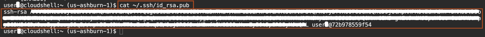
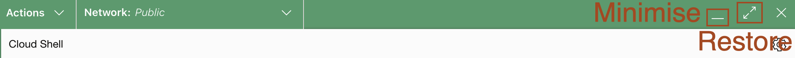

# Create the OCI resources

## Introduction
Before demonstrating autoscaling in the WebLogic for OCI stack, several prerequisites must be met to ensure a secure and efficient setup. In the interest of time, we have pre-created some of these prerequisites such as **authentication token**, a **Vault** with encryption keys and secrets, **OCI Policies**, **Compartment**, and an **Application Performance Monitoring** domain. In this lab, we will create a pair of SSH keys. 

Estimated Time: 05 minutes

### Objectives
* Know your pre-created OCI resources.
* Generate a pair of SSH keys.


### Prerequisites
This lab assumes you have the following:
- An Oracle Free Tier or Paid Cloud account
- This lab requires completion of the preceding labs.


## Task 1: Create a SSH key pair 

In this task, we create an SSH key pair in the Cloud Shell. We will use this SSH key to create the **WebLogic for OCI** stack. Later, we will log in to the WebLogic Compute node from Cloud Shell using these SSH keys.

1. In OCI Console, click on **Developer tools** icon and then click **Cloud Shell** as shown below.
   

2. Copy and paste the following command to ensure that you don't have an existing ssh key pair.
      ```bash
      <copy>ls -ltra ~/.ssh</copy>
      ```
      > If there is already **`id_rsa.pub`** file exist, you can skip step 3 and proceed with step 4.

3. Copy and paste the following command to generate the ssh key pair. Press **enter** to select the default values as shown below.
      ```bash
         <copy>ssh-keygen -b 2048 -t rsa</copy>
      ```
      

4. Copy and paste the following command to get the public key and save it in some text file. We will need it in the next lab. Leave this browser tab open, we will use this tab to run commands in the Cloud shell.
      ```bash
         <copy>cat ~/.ssh/id_rsa.pub</copy>
      ```
      

      > Don't close Cloud Shell, we will use this. You can minimise the **Cloud Shell** using **-** and restore Cloud Shell using the **restore icon** as shown.
      


      
## Task 2: Know your pre-created OCI resources.

In this task, you will understand the resources we created for you and what are their uses in WebLogic for the OCI stack. you must have data sheet with you, where you will have the value of these resources.

**Region Name**- We have created the resources for you in the **US East(Ashburn)** region. Make sure you are in this region.   

**Compartment**- When you create a domain with Oracle WebLogic Server for OCI, by default the compute instances, networks, and load balancer are all created within a single compartment. We have created the compartment for you, you will receive your compartment name from the lab instructor. 

**Policies**- Access to Oracle Cloud Infrastructure is controlled through policies.There are two major groupings of policies that are required by Oracle WebLogic Server for OCI:
   - User Group Policies
   - Dynamic Group Policies and Dynamic Group Policies for Autoscaling</br>
   > We have created the required policies for your username.


**Application Performance Monitoring Domain** - The Application Performance Monitoring (APM) domain in OCI provides comprehensive tools for monitoring and analyzing the performance of your applications. It helps in identifying bottlenecks and optimizing performance by offering detailed insights into application behaviour and resource usage. In this workshop, we have created an Application Performance Monitoring domain. you will receive your APM domain name from the lab instructor.

**Registry User** - To access image in the OCI registry to deploy autoscaling function, we have created the common user. you will receive the shared registry username from the lab instructor.

**OCIR Auth token** - In order for Oracle Cloud Infrastructure Registry to deploy autoscaling OCI Functions, you must provide an auth token. we have created an authentication token for the shared user and saved it as a secret inside the vault. 

**WLS Password** - While creating the WebLogic for OCI stack, we need to provide the Administrator password for the new WebLogic domain. we have saved this password as a secret inside the vault. You will receive the WebLogic Admin Server password from the lab instructor.

**Vault**- OCI Vault is an encryption management service that stores and manages encryption keys and secrets to securely access resources. In our workshop, we have stored the secrets for WebLogic Admin Server Password and OCIR Authentication token inside the Vault.


You may now proceed to the next lab.

## Acknowledgements
* **Author** -  Ankit Pandey
* **Contributors** - Adrian Padilla Duarte , Sid Joshi
* **Last Updated By/Date** - Ankit Pandey, July 2024
