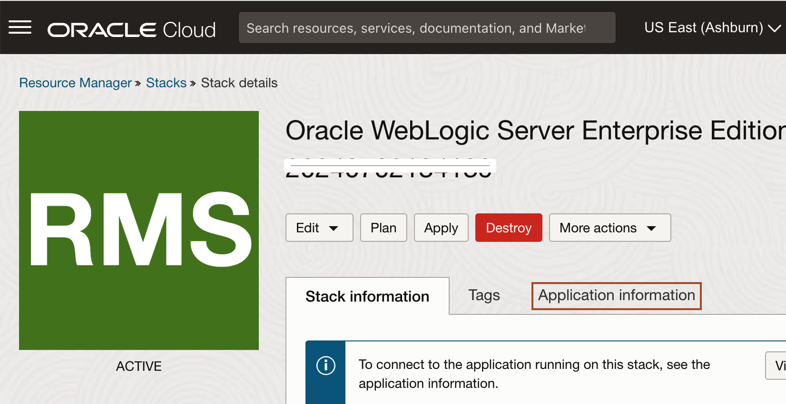
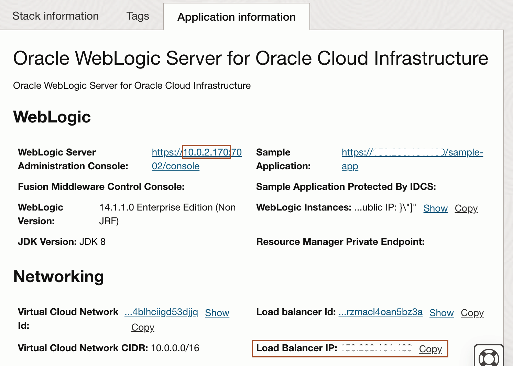
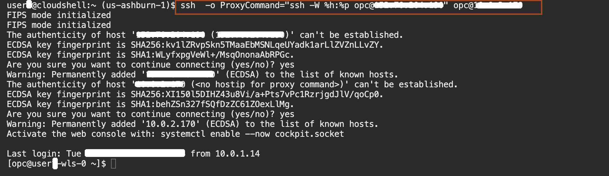
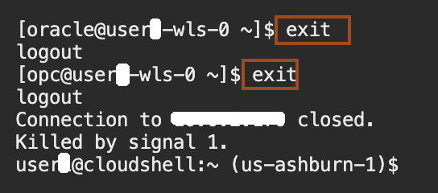

# Setup the resource for load enhancement

## Introduction

Before demonstrating autoscaling in the WebLogic for OCI stack, certain prerequisites must be fulfilled. This guide outlines the steps to validate stack deployment and extract essential IP addresses for the Bastion, Load Balancer, and WebLogic Server (WLS) Node. Then, you will ssh login to the WebLogic Node from the CloudShell. These steps are crucial for ensuring a functional and accessible WebLogic environment.

Estimated Time: 10 minutes

### Objectives

In this lab, you will:

* Validate the stack and copy the IP of **Bastion**, **Load balancer** and **WLS Node**
* SSH Login to WebLogic Node from the CloudShell

### Prerequisites
This lab assumes you have the following:

* An Oracle Cloud account
* This lab requires completion of all of the preceding labs.

## Task 1: Validate the stack and copy the IP of Bastion, Load balancer and WLS Node

In this task, we verify the creation of the stack and save IP of Bastion, Load Balancer and WebLogic Node.  

1. Go back to the browser tab, where you have the job running. Once you see the job status as **SUCCEEDED**, it means your stack is successfully created. Click **Stack details** as shown below. 
 

2. In the stack details page, click on the **Application information** tab as shown below.
 

3. From the **WebLogic** section, copy the **`WLS_NODE_IP`** for the WebLogic Server node from the **WebLogic Server Administration Console:** URL and save it in the text file. For example in the below screen, IP is **10.0.2.170**. Also, copy the IP for Load Balancer as shown below. Please save this value as **`LOAD_BALANCER_IP`** in the text file, we need it in the next lab.
 
    > *Don't take the value from the screenshot, they are just for the reference*. 

4. Copy the public IP for the Bastion node as shown below. Please save the value as **`BASTION_IP`** in the text file, we need it in the next task.
 


## Task 2: SSH Login to WebLogic Node from the CloudShell

In this task, we connect to WebLogic Node from the Cloud Shell using the SSH Key, **`BASTION_IP`** and **`WLS_NODE_IP`**. Then, we download and deploy a sample application **rcmweb.war** to the WebLogic Cluster. We use this application to increase the **CpuProcessLoad** on WebLogic Cluster.

1. Go back to CloudShell, copy and paste the following command in the text file and replace **`<BASTION_IP>`** and **`<WLS_NODE_IP>`** with their values from the text file..
      ```bash
         <copy>ssh  -o ProxyCommand="ssh -W %h:%p opc@<BASTION_IP>" opc@<WLS_NODE_IP></copy>
      ```
      > For example:  *ssh  -o ProxyCommand="ssh -W %h:%p opc@129.158.245.92 opc@10.0.2.75*.

2. Paste the modified command in Cloud Shell and enter **yes** as shown below. 
 

3. Copy and paste the following command to change the user from **opc** to **oracle** as shown below.
      ```bash
         <copy>sudo su - oracle</copy>
      ```
      

4. Copy and paste the following command in the Cloud Shell to download the application. You will notice the **rcmweb.war** in the terminal.
      ```bash
         <copy>curl -O https://objectstorage.us-ashburn-1.oraclecloud.com/p/DngDhX3N6cSYkCOJdN04oEVpFNW4CZ-0AgJd6wseEpnOTyDVDmViRtD9lLs9We-Z/n/ocloud200/b/ocw24assets/o/rcmweb.war
         ls  ~</copy>
      ```
      

5. Copy and paste the following command to set up the WebLogic Domain environment to deploy the application.
      ```bash
         <copy>. /u01/app/oracle/middleware/oracle_common/common/bin/setWlstEnv.sh</copy>
      ```

6. Copy and paste the following command in the text file and replace the Value for **`<USERNAME>_cluster`**, **`WLS_PASSWORD`** and **`<WLS_NODE_IP>`** from the text file. You must have received the value for  **`WLS_PASSWORD`** from your lab instructor.
      ```bash
         <copy>java weblogic.Deployer -adminurl 't3://<WLS_NODE_IP>:9071' -username weblogic -password 'WLS_PASSWORD' -deploy -name RCMWeb -targets '<USERNAME>_cluster' ~/rcmweb.war</copy>
      ```
      > For example:  *java weblogic.Deployer -adminurl ‘t3://10.0.2.75:9071’ -username weblogic -password cloudworld24 -deploy -name RCMWeb -targets user1_cluster ~/rcmweb.war*.

7. Paste the modified command to deploy the application in Cloud Shell as shown below.
   

8. Enter **exit** twice to go back to the local user in the Cloud Shell environment as shown below.
   


You may now proceed to the next lab.

## Acknowledgements
* **Author** -  Ankit Pandey
* **Contributors** - Adrian Padilla Duarte , Sid Joshi
* **Last Updated By/Date** - Ankit Pandey, July 2024