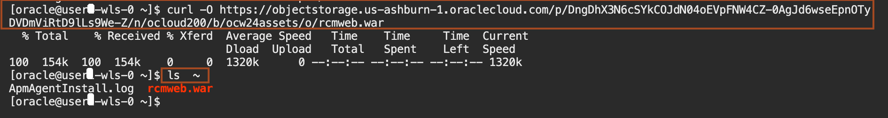

# Setup the resource for load enhancement

## Introduction

Before demonstrating autoscaling in the WebLogic for OCI stack, certain prerequisites must be fulfilled. This guide outlines the steps to SSH login to the WebLogic Node from the CloudShell, download and configure JMeter within the Cloud Shell environment, and obtain the load-generating configuration file. These preparations are essential for effectively simulating and observing autoscaling behavior.

Estimated Time: 10 minutes

### Objectives

In this lab, you will:

* SSH Login to WebLogic Node from the CloudShell
* Download and configure the JMeter for the Cloud Shell
* Download Load generatings configuration file

### Prerequisites
This lab assumes you have:

* An Oracle Cloud account
* Created Stack: Oracle WebLogic Server Enterprise Edition BYOL

## Task 1: Download and configure the JMeter for the Cloud Shell

In this task, We download Apache Jmeter and Configure PATH varibale in the Cloud Shell. We use Jmeter for simulating the CPU Load in the WebLogic Cluster.

1. Copy and paste the following command in the Cloud Shell to download the Jmeter and confiure it the Cloud Shell environment as shown below.
    ```bash
    <copy>cd ~
    wget https://dlcdn.apache.org//jmeter/binaries/apache-jmeter-5.6.3.zip
    unzip apache-jmeter-5.6.3.zip
    PATH=~/apache-jmeter-5.6.3/bin:$PATH</copy>
    ```

## Task 2: Download Load generating files

In this task, We download the files in the Cloud Shell. Thi

1. Copy and paste the following command in the Cloud Shell to download the load generating files. The JMX file contains the test plan, defining the parameters and behavior of the load test, while the Python (py) file will be used to increate the CpuLoad.

    ```bash
    <copy>curl -O https://objectstorage.uk-london-1.oraclecloud.com/p/efQcFhIIGIGAUeiBmC2KWJnmDS8a34GQkLaln4lSEIghkkZ0jyvgNqwIjrnBuj4b/n/lrv4zdykjqrj/b/ankit-bucket/o/autoscale-workshop.zip   
    unzip autoscale-workshop.zip
    cd ~/autoscale-workshop</copy>
    ```

## Task 3: SSH Login to WebLogic Node from the CloudShell

In this task, We connect to WebLogic Node from the Cloud Shell using the SSH Key, Bastion IP and WebLogic Node IP. Then, We download and deploy a sample application **RCMWeb** to WebLogic Cluster. We use this application to increase the CpuProcessLoad on WebLogic Cluster.

1. Go back to CloudShell, copy and paste the following command in text file and replace BASTION_IP and WLS_NODE_IP with the values, you saved in task 2 of lab 2.
    ```bash
    <copy>ssh  -o ProxyCommand="ssh -W %h:%p opc@<BASTION_IP>" opc@<WLS_NODE_IP></copy>
    ```

2. Paste the modified command in Cloud Shell as shown below.
    

3. Copy and paste the following command to change the user from **opc** to **oracle** as shown below.
    ```bash
    <copy>sudo su - oracle</copy>
    ```
    

4. Copy and paste the following command in the Cloud Shell to download the application. You will notice the **RCMWeb.war** in the terminal.
    ```bash
    <copy>curl -O https://objectstorage.uk-london-1.oraclecloud.com/p/yZ3htfFbAV2KVsV7bkt1gUQI_Gdg5wnN1rRS9475Qu61BYgo3_jg2BpURxbwe1n2/n/lrv4zdykjqrj/b/ankit-bucket/o/RCMWeb.war
    ls  ~</copy>
    ```
    

5. Copy and paste the following command to setup the WebLogic Domain environment to deploy the application.
    ```bash
    <copy>. /u01/app/oracle/middleware/oracle_common/common/bin/setWlstEnv.sh</copy>
    ```

5. Copy and paste the following command in text file and replace the Value for `**WLS_PASSWord**`, `**USERNAME**` and `**WLS_NODE_IP**`.
    ```bash
    <copy>java weblogic.Deployer -adminurl 't3://<WLS_NODE_IP>:9071' -username weblogic -password <WLS_PASSWORD> -deploy -name RCMWeb -targets <USERNAME>_cluster ~/RCMWeb.war</copy>
    ```

6. Paste the modified command to deploy the application in Cloud Shell as shown below.
    

7. Enter **exit** twice to go back to local user in the Cloud Shell environment as shown below.
    


You may now proceed to the next lab.

## Acknowledgements

* **Author** -  Ankit Pandey
* **Contributors** - Sid Joshi, Maciej Gruszka
* **Last Updated By/Date** - Ankit Pandey, June 2024