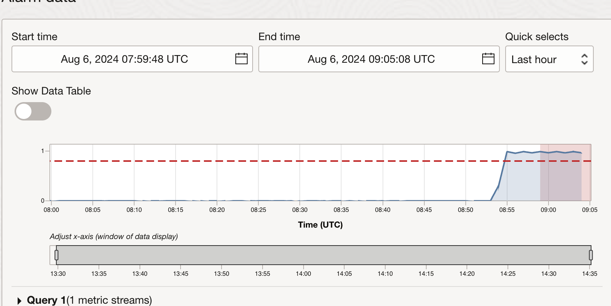
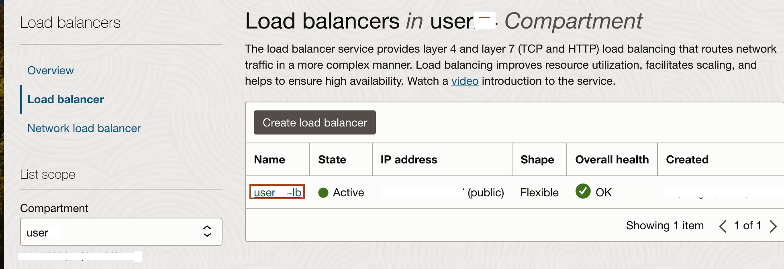
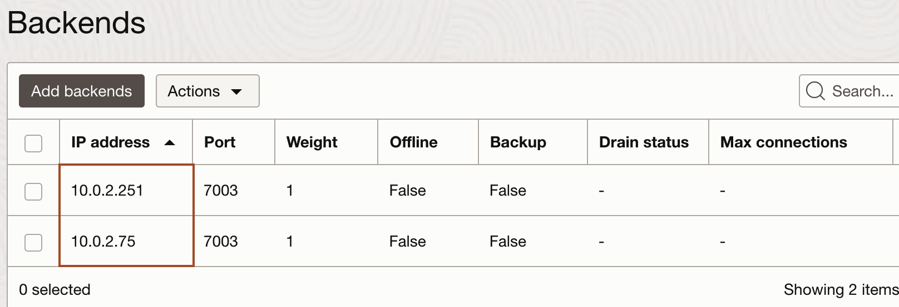
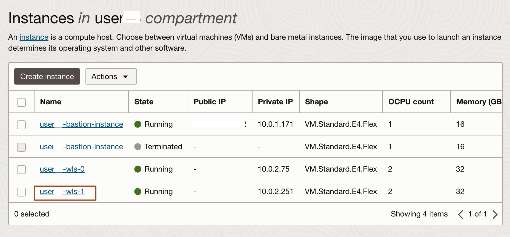

# Generate load and show autoscaling 

## Introduction

Monitoring and managing performance is crucial for maintaining an efficient Oracle Cloud Infrastructure (OCI) environment. This lab will help you observe the alarms created by the WebLogic for the OCI stack and generate CPU load on the WebLogic Server. By doing so, you can effectively view the scale-out, ensuring your applications run smoothly under varying load conditions.

Estimated Time: 10 minutes

### Objectives

In this lab, you will:

* Observe the Alarms created by WebLogic for the OCI stack.
* Generate the CPU Load on the WebLogic Server to view scaleout.

### Prerequisites
This lab assumes you have the following:

* An Oracle Cloud account
* This lab requires completion of all of the preceding labs.

## Task 1: Observe the Alarms created by WebLogic for the OCI stack

In this task, we observe the Alarms created by the stack. We will see the Alarm Definitions and Alarm Data.

1. In OCI Console, Click **Hamburger menu** -> **Observability & Management** -> **Alarm Definitions** under **Monitoring** section.
 

2. You will notice two alarm definitions, one for the **scalein** operation and the other for the **scaleout** operations. Click the alarm for the **scaleout** as shown below.
 
    
3. To enable the alarm, check the box for **Alarm is enabled**.
 


4. Observe the Status of the Alarm that is in the **OK** state. As you see in the summary  **ProcessCpuLoad is greater than the threshold value of 0.7**. Scroll down to view the Alarm data.
 
 

    > As there is no load on the WebLogic Cluster, you may see the values less than **.7** for the **ProcessCpuLoad**, that is why the **scaleout** alarm is in **Ok** state.


## Task 2: Generate the CPU Load on the WebLogic Server

In this task, we execute files downloaded in lab 2. This file enhances the ProcessCpuLoad and triggers the Scaleout Alarm. Which will increase the node count from 1 to 2. As soon as the load trigger the Scaleout alarm, we terminate the execution of the load generating file.

1. Go back to Cloud Shell, copy and paste the following command in the text file and replace the **`LOAD_BALANCER_IP`** with the load balancer public IP.
      ```bash
         <copy>PATH=~/apache-jmeter-5.6.3/bin:$PATH
         cd ~/autoscale-workshop
         python3 jmeterrunner.py -l <LOAD_BALANCER_IP> -n 4 -s CpuTime</copy>
      ```
      For example:  *python3 jmeterrunner.py -l 129.80.237.76 -n 4 -s CpuTime*.


2. Paste the modified command in the Cloud Shell to Create CPU Load in WebLogic Cluster as shown below.
   

3. Go back to Alarm data for the **scaleout** alarm, you will see the rise in ProcessCpuLoad as shown below.
   
    
    > You need to wait till the ProcessCpuLoad is more than **.7** for a period of more than **five minutes**. But it may take additional 2-3 minutes to trigger the alarm. 
   

4. Once you notice, load is more than **.7** for more than 8 minutes, scroll up and you can see the **scaleout** alarm is in a **firing** state, go back to Cloud Shell to terminate the load generate process by entering **`Ctrl+C`** in the Cloud Shell as shown below.
   
   


5. Now, we will see, one more compute node is added as backend set in the load balancer. In OCI Console, Click **Hamburger menu** -> **Networking** -> **Load balancer** under **Load balancers** section.
   

6. Click on your load balancer name as shown below.
   

7. Scroll down and click **Backend sets** under **Resources**.
   

8. click on your backend set name as shown below.
   

9. Click **Backends** under **Resources**, now you will see, one more compute instance has added to your cluster. 
   
      
      > You may need to wait, until the scaleout job completed successfully.

10. To see the new compute instance, Click **Hamburger menu** -> **Compute** -> **Instances**.
   

11. You can see the new node **userN-wls-1** has been created.
   

   You may now proceed to the next lab.
    

## Acknowledgements
* **Author** -  Ankit Pandey
* **Contributors** - Adrian Padilla Duarte , Sid Joshi
* **Last Updated By/Date** - Ankit Pandey, July 2024