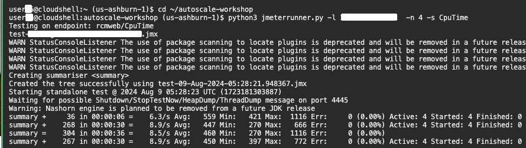

# Generate load and show autoscaling 

## Introduction

Monitoring and managing performance is crucial for maintaining an efficient Oracle Cloud Infrastructure (OCI) environment. This lab will help you observe the alarms created by the WebLogic for OCI stack and generate CPU load on the WebLogic Server. By doing so, you can effectively view the scaling activities—both scale-out and scale-in—ensuring your applications run smoothly under varying load conditions.

Estimated Time: 10 minutes

### Objectives

In this lab, you will:

* Observe the Alarms created by WebLogic for OCI stack
* Generate the CPU Load on WebLogic Server to view scaleout and scalein respectively

### Prerequisites
This lab assumes you have:

* An Oracle Cloud account
* Created Stack: Oracle WebLogic Server Enterprise Edition BYOL

## Task 1: Observe the Alarms created by WebLogic for OCI stack

In this task, we observe the Alarms created by the stack. We will see the Alarm Definitions and Alarm Data.

1. In OCI Console, Click **Hamburger menu** -> **Observability & Management** -> **Alarm Definitions** under **Monitoring** section.
    

2. You wil notice two alarm definitions, one for the **scalein** operation and other for the **scaleout** operations. Click the alarm for the scalein as shown below.
    
    

3. Observe the Status of Alarm that is in **firing** state. As you see in the summary  **ProcessCpuLoad is less than the threshold value of 0.1**. Scroll down to view the Alarm data.
    
    


4. Click **Alarm Definition** and then click the alarm for **scaleout** operation as shown below.
    

5. Observe the Status of Alarm that is in **Ok** state. As you see in the summary  **aggregate Mean of ProcessCpuLoad is greater than the threshold value of 0.6,**. Scroll down to view the Alarm data.
    
    

6. In the **Alarm data** select the data for **Last hour** in the Quick selects and toggle the button for **Show Graph** to view the data in numbers as shown below.
    

    > As there is no load on the WebLogic Cluster, you may see the values less then **.1** for the **ProcessCpuLoad**, that is why **scalein** alarm in firing state and **scaleout** alarm in **Ok** state.


## Task 2: Generate the CPU Load on WebLogic Server

In this task, we execute files downloaded in lab 3. This files enhances the ProcessCpuLoad and trigger the Scaleout Alarm. Which will increase the node count from 1 to 2. As soon as the load trigger the Scaleout alarm, we terminate the execution of load generating file. This will reduce the ProcessCpuLoad and trigger the Scalein Alarm.

1. Copy and paste the following command in the text file and replace the `**LOAD_BALANCER_IP**` with  the load balancer public IP you saved in task 2 of lab 2.
    ```bash
    <copy>cd ~/autoscale-workshop
    python3 jmeterrunner.py -l <LOAD_BALANCE_IP> -n 3000 -s CpuTime</copy>


2. Paste the modified command in the Cloud Shell to Create CPU Load in WebLogic Cluster as shown below.
    

3. Go back to Alarm data for the **scaleout** alarm, you will see the rise in ProcessCpuLoad  as shown below.
    
    
    > You need to wait till the ProcessCpuLoad  is more than **.6** for a period of more than **five minutes**.
    

4. You will also receive the email about the scaleout operation in the email id provided during stack creation as shown below.
    

5. Go back to CloudShell to terminate the load generate process by entering `**Ctrl + C**` in the CloudShell as shown below.
    

6. You will also receive the email about the **Scaling Job Completed** as shown below.
    

7. Go back to Alarm data for the **scalein** alarm, you will see the drop in load as we stopped the load generating application as shown below.
    

8. As you see the values in less then **.1** for the ProcessCpuLoad continuously for five minuts. So it trigger the **scalein** alarm and you will receive the email about the same.
    

9. You will also receive the email about the **Scaling Job Completed** as shown below.
    

You may now proceed to the next lab.
    

## Acknowledgements

* **Author** -  Ankit Pandey
* **Contributors** - Sid Joshi, Maciej Gruszka
* **Last Updated By/Date** - Ankit Pandey, June 2024