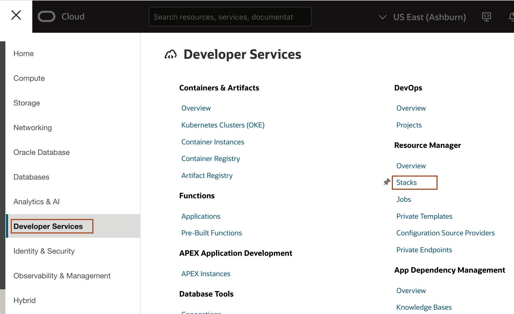
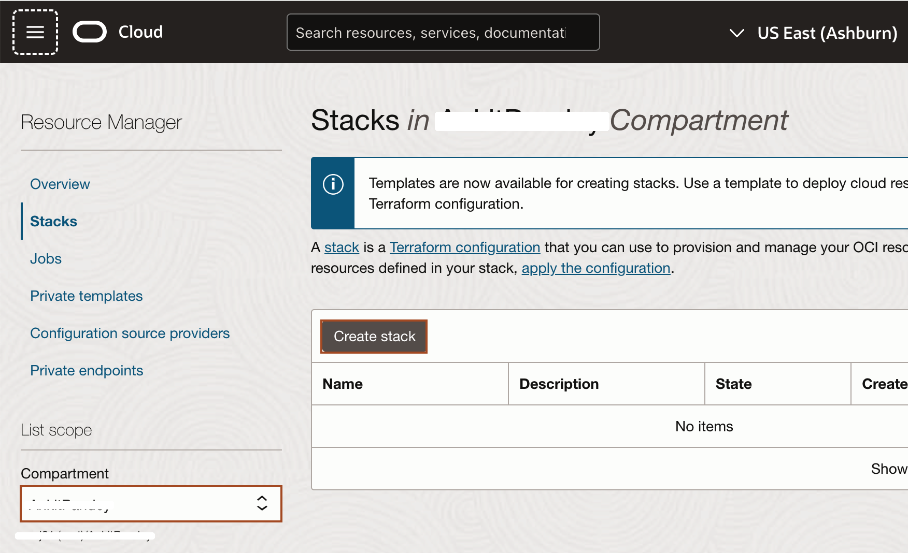
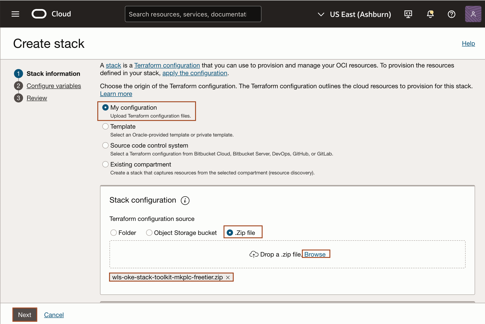
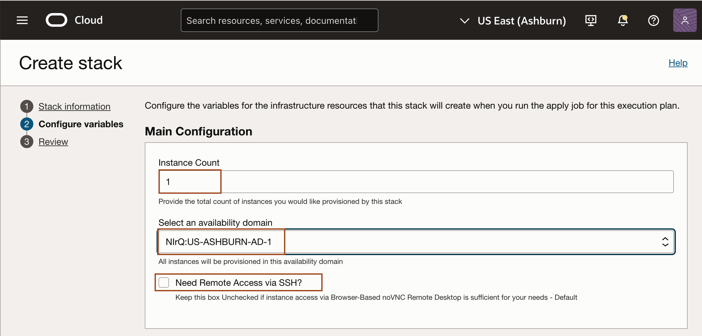
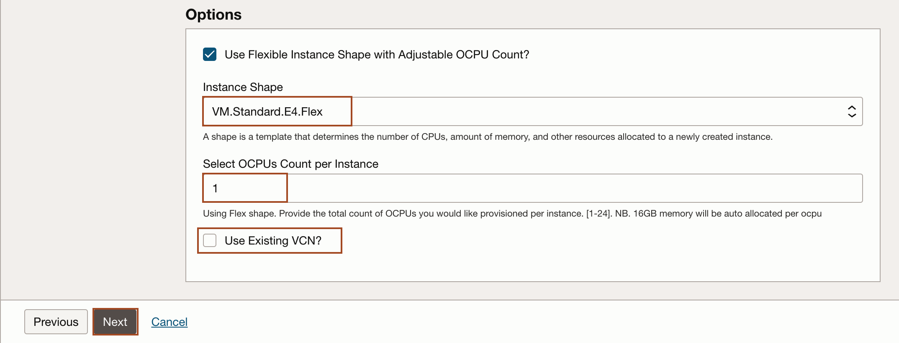
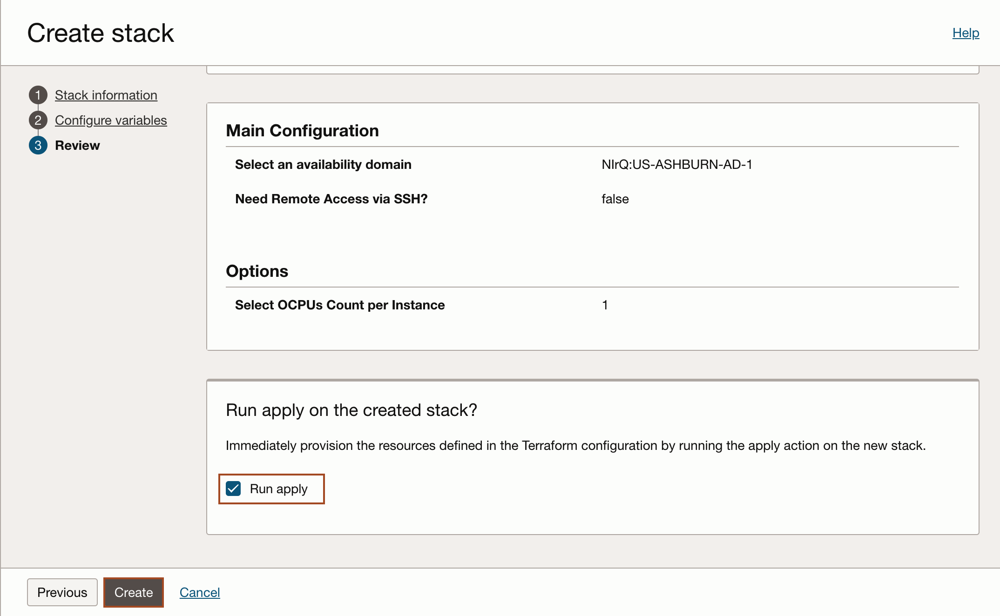

# Prepare Setup

## Introduction
This lab will show you how to download the Oracle Resource Manager (ORM) stack zip file needed to setup the resource needed to run this workshop. Then you creates a compute instance and a Virtual Cloud Network (VCN) which provides you access to a remote desktop.

Estimated Time: 10 minutes

### Objectives
* Download ORM stack
* Create Compute + Networking using Resource Manager Stack

### Prerequisites
This lab assumes you have:
- An Oracle Free Tier or Paid Cloud account

## Task 1: Download Oracle Resource Manager (ORM) stack zip file

1.  Click on the link below to download the Resource Manager zip file you need to build your environment:

    *Note 1:* If providing a single Stack download for the workshop, use this simple expression.

    - [wls-oke-stack-toolkit-mkplc-freetier.zip](https://objectstorage.uk-london-1.oraclecloud.com/p/VaB6UBJxoA7UZ6nVXEYnorwQTepG0EerarP0p4NcO1z0Rb_Y9kyYZEBl38TtH4_4/n/lrv4zdykjqrj/b/ankit-bucket/o/wls-oke-stack-toolkit-mkplc-freetier.zip)

2.  Save in your downloads folder.

## Task 2: Create Stack: Compute + Networking

1. Identify the ORM stack zip file downloaded in **Task 1: Download Oracle Resource Manager (ORM) stack zip file**.

2. Open up the hamburger menu in the top left corner. Click **Developer Services**, and choose **Resource Manager** > **Stacks**. Choose the compartment in which you would like to install the stack. Click **Create Stack**.
    
    

3. Select **My Configuration**, choose the **.Zip** file button, click the **Browse** link, and select the zip file that you downloaded or drag-n-drop for the file explorer. Click **Next**.
    

4. Enter or select the following and click **Next**.

    **Instance Count:** Accept the default, 1.

    **Select Availability Domain:** Select an availability domain from the dropdown list.

    **Need Remote Access via SSH?** Keep Unchecked for Remote Desktop only Access - The Default.

    **Use Flexible Instance Shape with Adjustable OCPU Count?:** Keep the default as checked (unless you plan on using a fixed shape).

    **Instance Shape:** Keep the default or select from the list of Flex shapes in the dropdown menu (e.g VM.Standard.E4.Flex).

    **Select OCPUs Count per Instance:** Accept the default shown. e.g. (1) will provision 1 OCPUs and 16GB of memory. 

    **Use Existing VCN?:** Accept the default by leaving this unchecked. This will create a new VCN.
    
    

7. Select **Run Apply** and click **Create**.
    

You may now proceed to the next lab.

## Acknowledgements
* **Author** -  Ankit Pandey
* **Contributors** - Maciej Gruszka, Sid Joshi
* **Last Updated By/Date** - Ankit Pandey, October 2024
