# Set up compute instance

## Introduction

This lab will show you how to set up a **Oracle WebLogic Suite for OKE BYOL** stack that will generate the Oracle Cloud objects needed to run your workshop.

Estimated Time: 15 minutes

### Objectives

In this lab, you will:

* Generate an authentication token.
* Create a secret in a Vault
* Create a Stack: Oracle WebLogic Suite for OKE BYOL
* Connect to compute instance

### Prerequisites
This lab assumes you have:

* An Oracle Cloud account
* You have generated the pair of SSH keys.
* You have completed: **Lab: Prepare Setup**

## Task 1: Generate an Authentication Token 

In this task, we will generate an *Authentication Token*. In lab 5, we will use this authentication token to push auxiliary image into the Oracle Cloud Container Registry Repository. Also, we use this authentication token to pull WebLogic docker images to Oracle Cloud Infrastructure Registry (also known as Container Registry). 

1. Select the User Icon in the top right corner and then select *User settings*.

    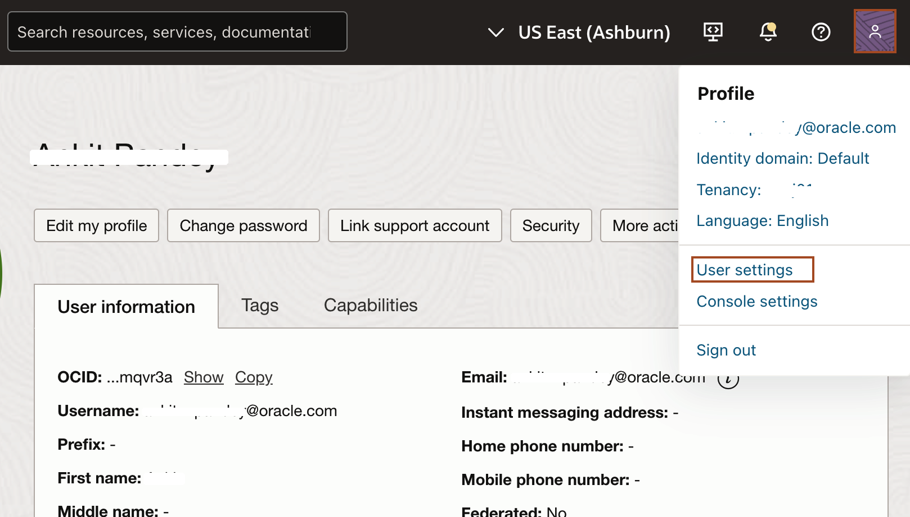

2. Scroll down and select *Auth Tokens* and then click *Generate Token*.

    

3. Copy *`test-model-your_first_name`* and paste it in the *Description* box and click *Generate Token*.

    

4. Select *Copy* under Generated Token and paste it in your text file. We cannot copy it later. Click *Close*.

    
    > In the next task, we will store this authentication token in **Secret**.

## Task 2: Create a secret in a vault 

Secrets are credentials such as passwords, certificates, SSH keys, or **authentication tokens** that you use with Oracle Cloud Infrastructure services. 

1. In OCI Console, Click **Hamburger menu** -> **Identity & Security** -> **Vault**.
    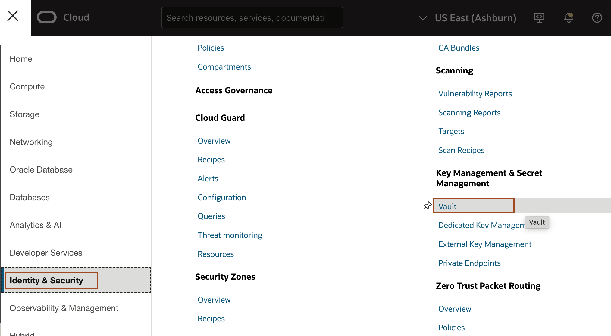

2. Select the compartment under **List scope** and then click **Create Vault**.

3. Enter the name of the Vault and click **Create Vault**.
    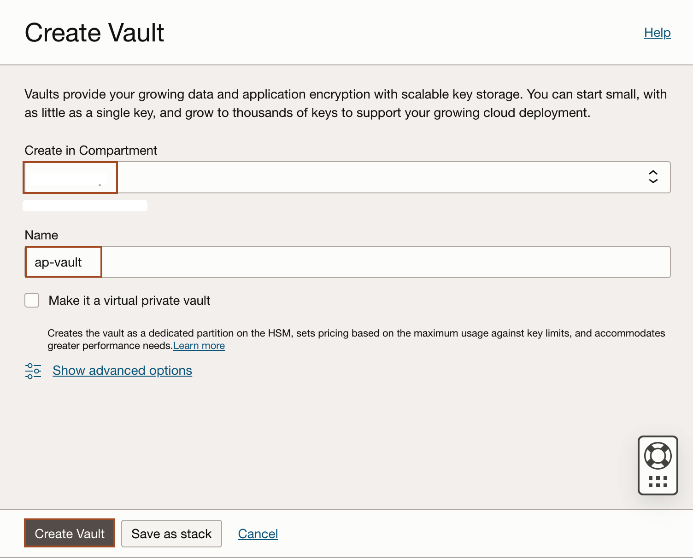

4. Once you see the Vault you created is in **Active** State, Click on the Vault name as shown below.
    

5. Inside the vault, click **Master Encryption Keys** and then click **Create Key**.
    

6. Enter the name for the **key** and then click **Create Key** as shown below.
    

7. Once you see the state for new Master Encryption key change to **Enabled** then click **Secrets** under **Resources** as shown below.
    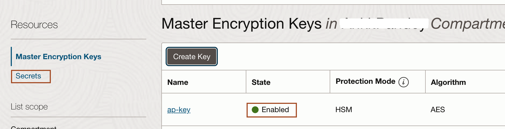

8. Click **Create Secret**.

9. Enter the name for Secret and choose the new Encryption key and then select **Manual secret generation** and enter the authentication token as **Secret Contents** as shown below. Click **Create Secret**.
    

## Task 3: Create Stack: Oracle WebLogic Suite for OKE BYOL

1. In OCI Console, click **Hamburger menu** -> **Marketplace** -> **All Applications**.
    

2. Type **WebLogic OKE** in the search box and then click **Oracle WebLogic Suite for OKE BYOL**.
    

3.  Select the latest version available and choose your compartment and check the box for accepting the terms and condition. Click **Launch Stack**.
    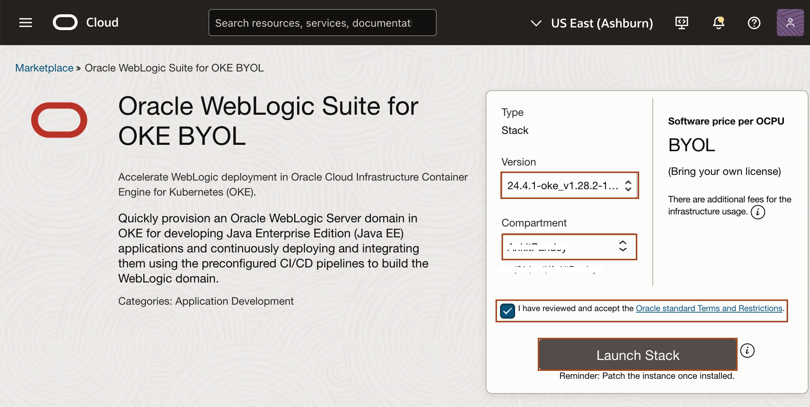

4. In Stack information section, leave everything default and click **Next**.
    

5. Enter **wko** as Resource Name Prefix and Click Browse to choose the SSH Public key.
    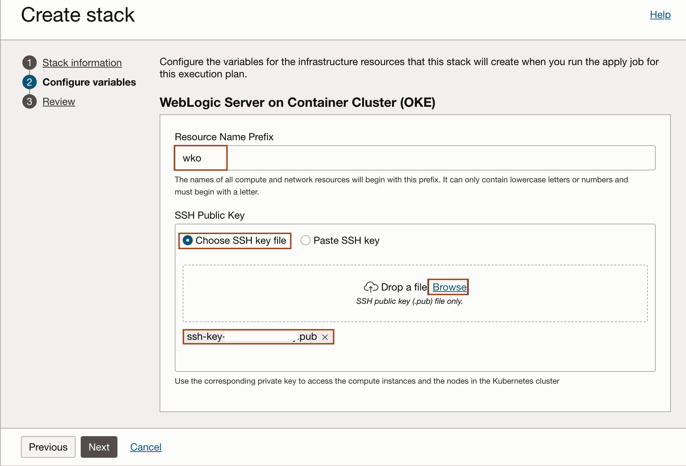

    > Make sure you use **wko** as prefix, as we will use this in further labs.

6. In Network, Select **Create a New VCN** as Virtual Cloud Network Strategy and leave everything default.
    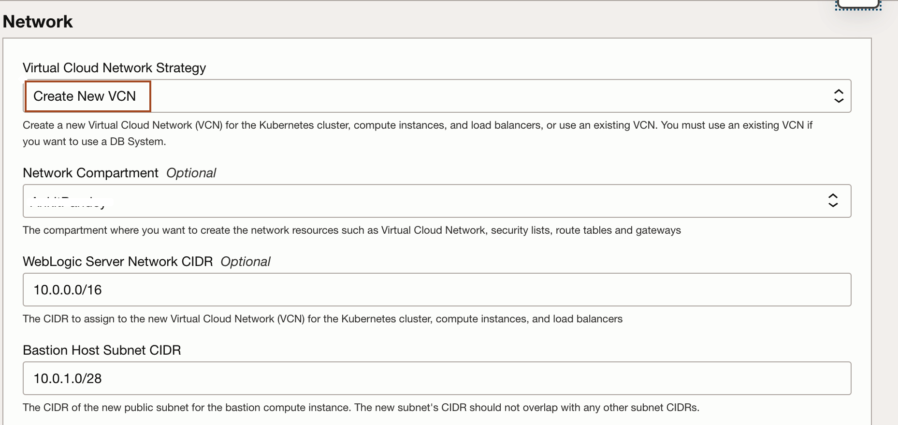

7. In Container Cluster (OKE) Configuration, Select the following.

    **Kubernetes version:** - Leave the default **v1.28.2**.

    **Non-WebLogic Node Pool Shape (Required)** - Select **VM.Standard.E4.Flex** as shape and chooke **1** as Number of OCPU and **16** as Amount of Memory.

    **Node in the NodePool for non-WebLogic pods** - Leave the default **1**.

    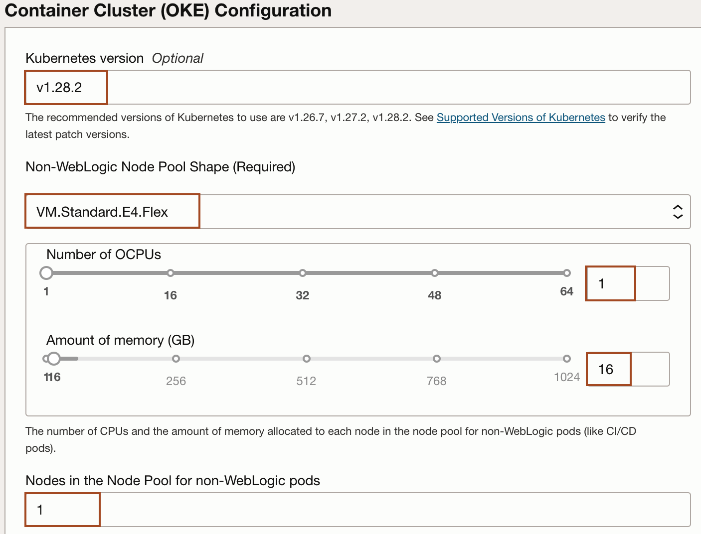

    **Create WebLogic Node Pool Shape** - Leave the default box as checked.

    **WebLogic Node Pool Shape (Required)** - Select **VM.Standard.E4.Flex** as shape and chooke **1** as Number of OCPU and **16** as Amount of Memory.

    **Node in the NodePool for WebLogic pods** - Leave the default **1**.

    

8. In Administration Instances, Enter or select the following as shown.
    **Availability Domain for compute instances** - Select the availability domain from the drop down.

    **Administration Instance Compute Shape (Required)**- Select **VM.Standard.E4.Flex** as shape and chooke **1** as Number of OCPU and **16** as Amount of Memory.

    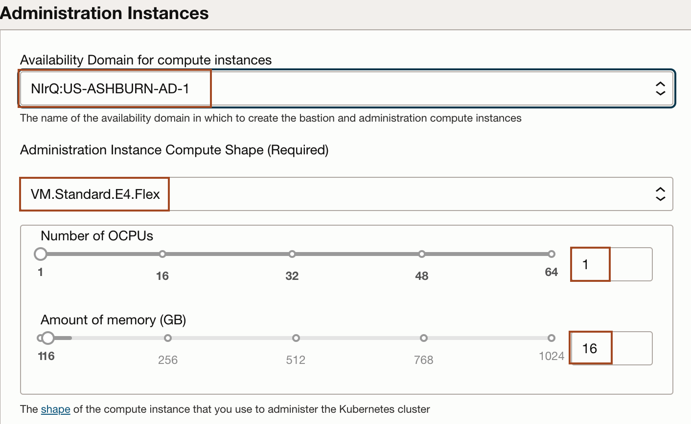

    **Bastion Instance Shape (Required)** - Select **VM.Standard.E4.Flex** as shape and chooke **1** as Number of OCPU and **16** as Amount of Memory.

    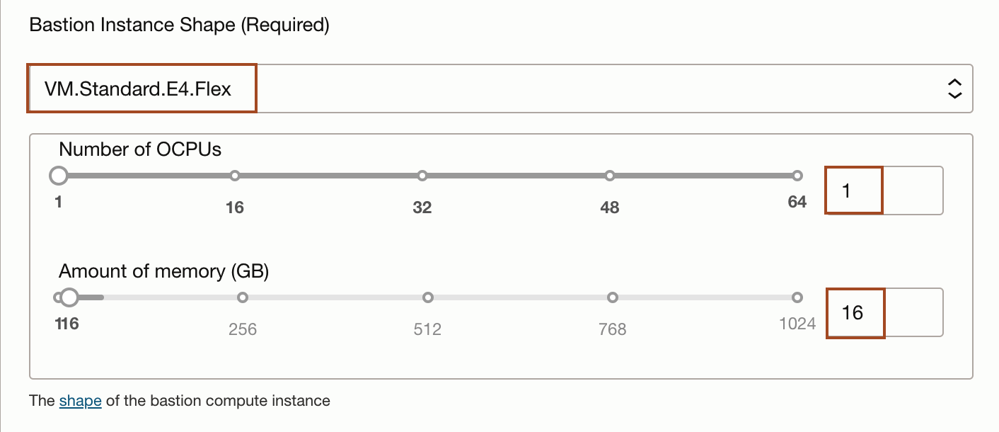

9. In File System section, Select the following as shown.
    **Availability Domain for File system** - Select the availability domain from the drop down.
    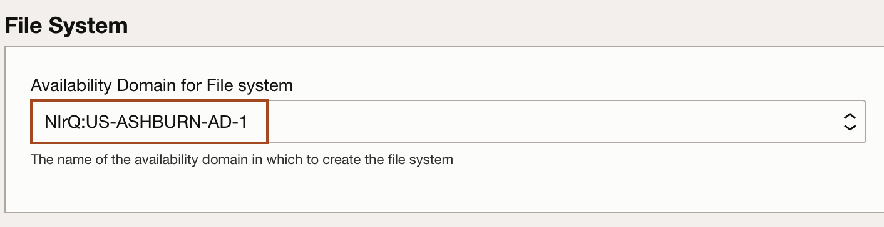

10. In Registry (OCIR) section, enter the following as shown.

    **Registry User Name** - The user name that Kubernetes uses to access the container image registry, which has the format {identity domain name}/{username}. If your tenancy is using Oracle Identity Cloud Service, use the format oracleidentitycloudservice/{username}.

    **OCIR Auth Token Compartment** - Select the compartment where you have the OCIR auth token.

    **Validated Secret for OCIR Auth Token** - The secret that contains the OCIR auth token that you generated for the user to access the image registry.

    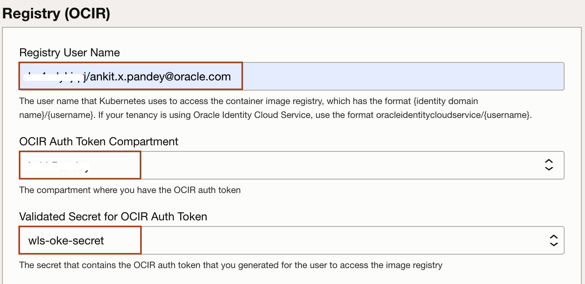

11. In OCI Policies, check the box for **OCI Policies**. It Create policies to read Secrets from Vault and manage Autonomous Transaction Processing Database (if applicable). Click **Next**.

12. In Review section, Check the box for **Run apply** and then click **Create**.
    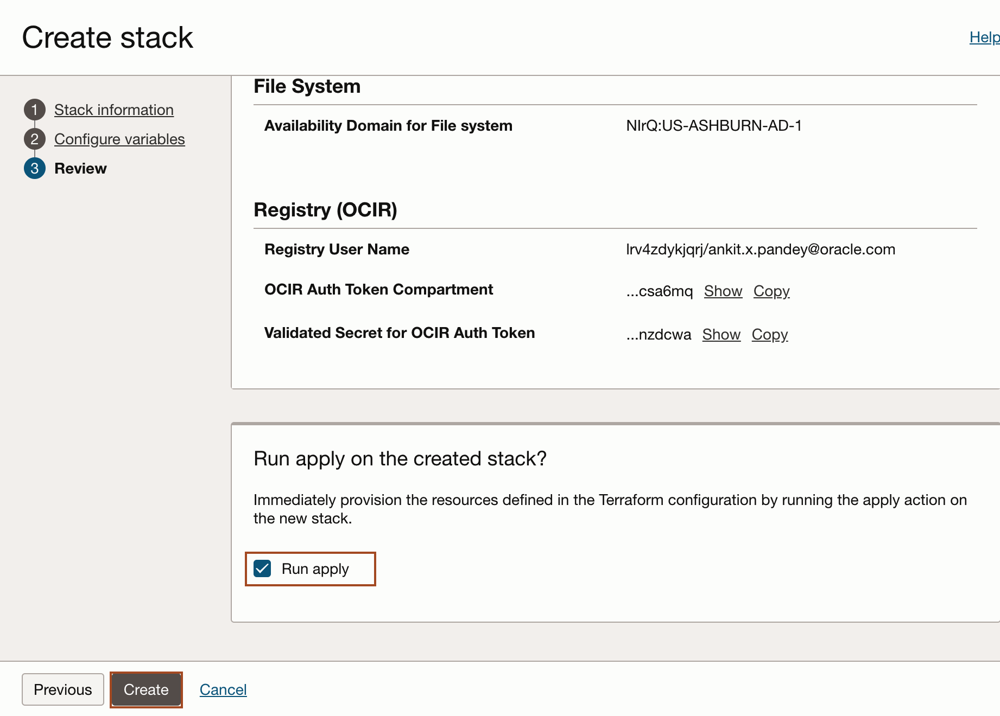

    > This will create a Job, which will create the required resources in the stack. You dont need to wait, please proceed to next task,

## Task 4: Access the Graphical Remote Desktop

For ease of execution of this workshop, your VM instance has been pre-configured with a remote graphical desktop accessible using any modern browser on your laptop or workstation. Proceed as detailed below to log in.

1. Open up the hamburger menu in the top left corner. Click **Developer Services**, and choose **Resource Manager** > **Stacks**.

2. Click on the stack name which you have createed in lab 1.
    

3. Navigate to **Application Information** tab, and copy **Remote Desktop URL** and paste it in new browser tab.
    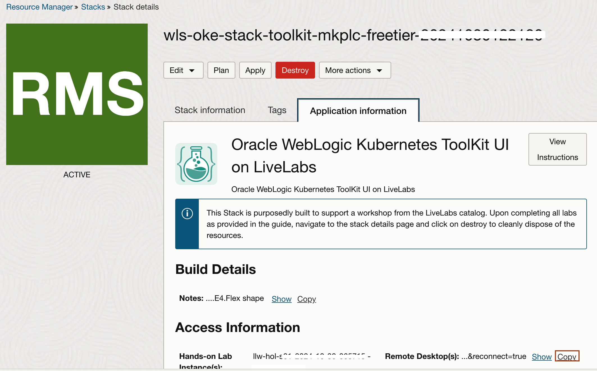
    
    > Now you need to follow all the instruction inside this remote desktop.

You may now proceed to the next lab.

## Acknowledgements

* **Author** -  Ankit Pandey
* **Contributors** - Maciej Gruszka, Sid Joshi
* **Last Updated By/Date** - Ankit Pandey, October 2024