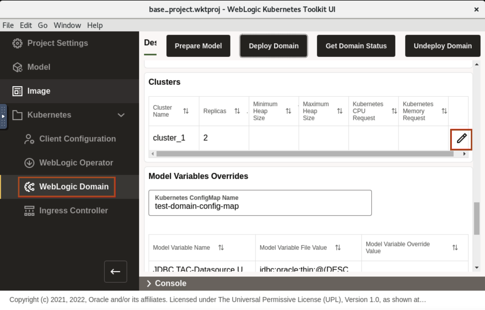
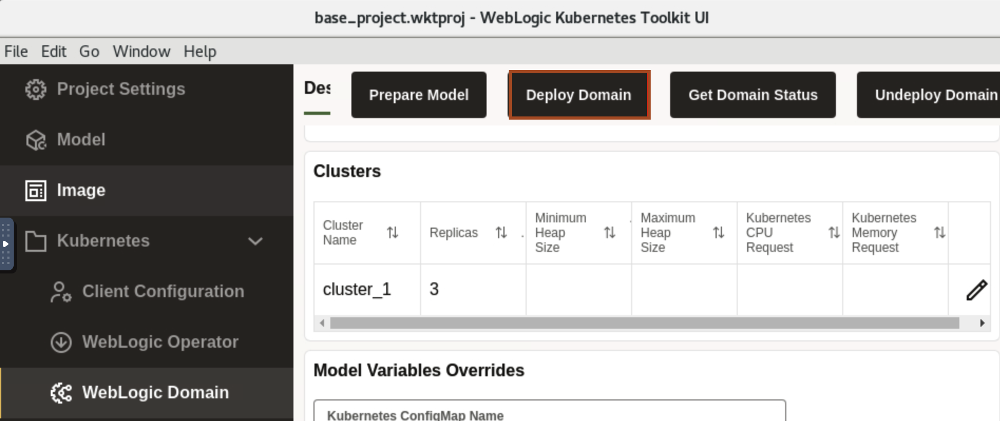
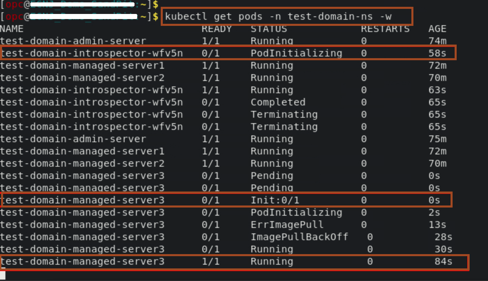

# Scale a WebLogic Cluster (Optional) 

## Introduction

In this lab, we scale a WebLogic Cluster. Here, we modify the value to *3* and re-deploy the domain.

Estimated Time: 5 minutes

### Objectives

In this lab, you will:

* Scale a WebLogic Cluster.


## Task 1: Scaling a WebLogic Cluster using WebLogic Kubernetes Toolkit UI

In this task, you just need to modify the *Replica* value from 2 to 3 and re-deploy the domain again. 

1. Go back to WebLogic Kubernetes Toolkit UI,  Click *WebLogic Domain*. Go to *Clusters* section and click on *Edit* icon.  
    

2. Change the Replicas from *2* to *3*, and click *OK*. 
    

3. To Re-deploy the domain, click *Deploy Domain*.
    

4. Once you see *WebLogic Domain Deployment to Kubernetes Complete* window, click *Ok*.
    

5. Go back to *Terminal* window, Click *Activities* and select the *Terminal* window. Copy the following command and paste in terminal.
    ```bash
    <copy>kubectl get pods -n test-domain-ns -w</copy>
    ```
    
    > You can see, re-deployment of domain, starts the introspector job, which start the process of creating pod for test-domain-managed-server3 and in sometime, this pod gets into *Running* status.

6. Go back to browser, where you have the application page open. Click Refresh button, you will see the load balancing between three managed server now.
    

7. Go back to WebLogic Remote Console, click on *Monitoring Tree* -> *Environment* -> *Servers*. You will notice managed-server3 here also.
    


## Acknowledgements

* **Author** -  Ankit Pandey
* **Contributors** - Maciej Gruszka, Sid Joshi
* **Last Updated By/Date** - Ankit Pandey, October 2023